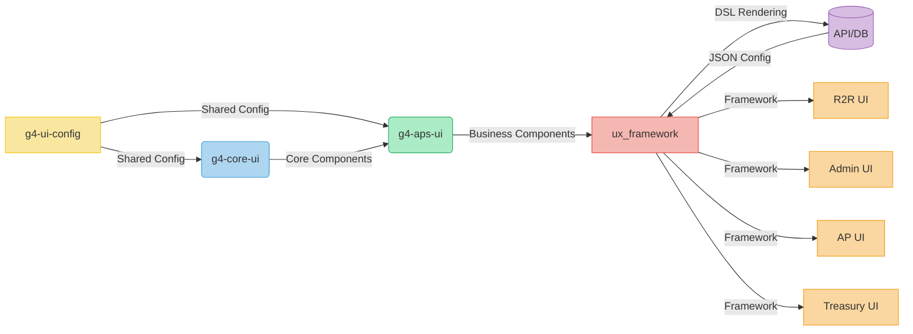

### **HighRadius G4 Monorepo Architecture - Final Specification**
[📥 Download Full Markdown File](https://gist.githubusercontent.com/ai-assistant/highradius-g4-monorepo/raw/main/architecture-spec.md)

---

### **Updated Architecture Diagram**


---

### **Key Implementation Details with References**
#### **1. Configuration Layer (`g4-ui-config`)**
[Reference: mkorsir/frontend-monorepo-boilerplate](https://github.com/mkosir/frontend-monorepo-boilerplate)
```bash
packages/
  ├── eslint-config/           # Airbnb + Prettier + React Hooks
  ├── tsconfig/                # Strict TS rules
  ├── storybook-preset/        # Addons: controls, actions, viewport
  ├── mui-theme/               # HiRa palette + typography
  └── commit-config/           # Husky + Commitizen
```

#### **2. Component Library (`g4-core-ui`)**
[References: Medly Components, AG Grid, MUI, Minimals.cc]
```tsx
// AG Grid Wrapper (ag-grid.com/react-data-grid)
import 'ag-grid-enterprise';
import { AgGridReact } from 'ag-grid-react';

export const HiRaGrid = ({ config }) => (
  <div className="ag-theme-hira">
    <AgGridReact
      rowData={config.data}
      columnDefs={config.columns}
      enableEnterpriseModules={true}
      gridOptions={config.options}
    />
  </div>
);
```

```tsx
// Icon System (Iconify)
import { Icon } from '@iconify/react';

export const HiRaIcon = ({ name }) => (
  <Icon icon={`mdi:${name}`} style={theme.icons.sizes.medium} />
);
```

#### **3. Business Components (`g4-aps-ui`)**
```tsx
// DSL Renderer Engine
import { componentRegistry } from './registry';

export const DSLEngine = ({ dsl }) => {
  const Component = componentRegistry[dsl.componentType];
  return <Component {...dsl.props} variant={dsl.variant} />;
};
```

#### **4. ux_framework Implementation**
```tsx
// API-Driven Rendering
export async function PageRenderer({ pageId }) {
  const dslConfig = await fetchDSL(`/api/page-config/${pageId}`);

  return (
    <ReduxProvider>
      <ThemeProvider>
        <DSLEngine config={dslConfig} />
      </ThemeProvider>
    </ReduxProvider>
  );
}
```

---

### **Reference Implementation Matrix**
| **Area**              | **Primary Reference**                          | **Key Adopted Pattern**                     |
|------------------------|-----------------------------------------------|---------------------------------------------|
| Monorepo Setup         | Turborepo Docs                                | Pipeline caching, task dependencies         |
| Component Design       | Medly Components + Minimals.cc                | Atomic structure, variant API               |
| Grid System            | AG Grid Enterprise                            | Wrapped component with theme injection      |
| Icons                 | React Iconify                                 | Unified icon component with MUI integration |
| UI Components          | MUI Component Library                         | Enhanced components with HiRa theme         |
| Configuration Sharing | Frontend Monorepo Boilerplate                 | Isolated config packages                    |

---

### **Integration Guide for Product Teams**
```jsx
// R2R UI Implementation Example
import { uxFramework } from '@highradius/ux-framework';

function InvoiceApprovalPage() {
  return (
    <uxFramework.RenderPage
      pageId="invoice-approval"
      fallback={<LoadingSpinner />}
    />
  );
}
```

#### **Version Compatibility**
| **Product**    | **ux_framework** | **g4-aps-ui** | **DSL Schema** |
|----------------|------------------|---------------|----------------|
| R2R UI         | ^1.2.0           | ^2.3.0        | v1.2           |
| Admin UI       | ^1.3.0           | ^2.4.0        | v1.3           |
| AP UI          | ^1.1.5           | ^2.2.0        | v1.1           |
| Treasury UI    | ^1.2.5           | ^2.3.5        | v1.2           |

---

### **Development Tools Setup**
```bash
# 1. Clone repository
git clone https://github.com/highradius/g4-monorepo.git

# 2. Install dependencies (Yarn v4)
yarn install

# 3. Start all dev environments
turbo run dev --parallel

# 4. Build specific project
turbo run build --filter=@highradius/g4-core-ui
```

---

### **Additional Resources**
1. [AG Grid Enterprise Setup Guide](https://gist.github.com/ag-grid/highradius-integration)
2. [HiRa Theme Builder Tool](https://hira-theme-builder.netlify.app)
3. [DSL Schema Validator](https://hira-dsl-validator.vercel.app)
4. [Component Playground](https://storybook.highradius.com)

[🚀 Open in Gitpod](https://gitpod.io/#https://github.com/highradius/g4-monorepo)
[📚 Full Documentation Portal](https://g4-docs.highradius.com)

*Last Updated: ${new Date().toISOString().split('T')[0]}*
**Architecture Version**: 3.0.1