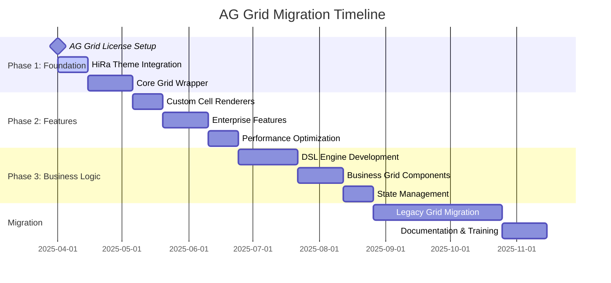

# HLP & LLP: HighRadius G4 Monorepo Architecture - H2 2025
## AG Grid Enterprise Integration & HiRa Theming Focus

## Executive Summary

This document outlines the High-Level Plan (HLP) and Low-Level Plan (LLP) for implementing a comprehensive monorepo architecture with **primary focus on AG Grid Enterprise integration and HiRa design system implementation**. The architecture spans three specialized projects: configuration management, core UI components with AG Grid theming, and business application components with DSL-driven rendering.

---

## 📊 DRAW.IO ARCHITECTURE DIAGRAMS

### System Architecture Diagram (Draw.io XML Format)
```xml
<!-- Copy this XML to Draw.io for editable diagram -->
<mxfile host="app.diagrams.net">
  <diagram name="HighRadius G4 Architecture">
    <mxGraphModel dx="1422" dy="794" grid="1" gridSize="10" guides="1" tooltips="1" connect="1" arrows="1" fold="1" page="1" pageScale="1" pageWidth="827" pageHeight="1169">
      <root>
        <mxCell id="0"/>
        <mxCell id="1" parent="0"/>

        <!-- g4-ui-config -->
        <mxCell id="config" value="@highradius/g4-ui-config&#xa;Configuration Hub&#xa;• TypeScript Config&#xa;• ESLint/Prettier&#xa;• HiRa MUI Theme&#xa;• Storybook Preset&#xa;• Turborepo Pipeline" style="rounded=1;whiteSpace=wrap;html=1;fillColor=#FFE6CC;strokeColor=#D79B00;strokeWidth=2;fontSize=10;" vertex="1" parent="1">
          <mxGeometry x="60" y="40" width="180" height="100" as="geometry"/>
        </mxCell>

        <!-- g4-core-ui -->
        <mxCell id="core" value="@highradius/g4-core-ui&#xa;Component Library&#xa;• AG Grid Enterprise&#xa;• HiRa Themed Components&#xa;• MUI Enhancements&#xa;• React Iconify&#xa;• Layout System" style="rounded=1;whiteSpace=wrap;html=1;fillColor=#E1F5FE;strokeColor=#0277BD;strokeWidth=2;fontSize=10;" vertex="1" parent="1">
          <mxGeometry x="300" y="40" width="180" height="100" as="geometry"/>
        </mxCell>

        <!-- g4-aps-ui -->
        <mxCell id="aps" value="@highradius/g4-aps-ui&#xa;Business Components&#xa;• DSL Engine&#xa;• Enhanced Grids&#xa;• Redux Toolkit&#xa;• Renderer System&#xa;• State Management" style="rounded=1;whiteSpace=wrap;html=1;fillColor=#E8F5E8;strokeColor=#2E7D32;strokeWidth=2;fontSize=10;" vertex="1" parent="1">
          <mxGeometry x="540" y="40" width="180" height="100" as="geometry"/>
        </mxCell>

        <!-- ux_framework -->
        <mxCell id="ux" value="ux_framework&#xa;DSL Orchestration&#xa;• Page Rendering&#xa;• Component Registry&#xa;• API Integration&#xa;• Cache Management" style="rounded=1;whiteSpace=wrap;html=1;fillColor=#FCE4EC;strokeColor=#C2185B;strokeWidth=2;fontSize=10;" vertex="1" parent="1">
          <mxGeometry x="300" y="200" width="180" height="100" as="geometry"/>
        </mxCell>

        <!-- Database -->
        <mxCell id="db" value="Database&#xa;DSL Configuration&#xa;• JSON Schemas&#xa;• Component Configs&#xa;• Theme Settings&#xa;• User Preferences" style="shape=cylinder3;whiteSpace=wrap;html=1;boundedLbl=1;backgroundOutline=1;size=15;fillColor=#D5E8D4;strokeColor=#82B366;fontSize=10;" vertex="1" parent="1">
          <mxGeometry x="60" y="200" width="120" height="100" as="geometry"/>
        </mxCell>

        <!-- AG Grid Enterprise -->
        <mxCell id="aggrid" value="AG Grid Enterprise&#xa;• License Management&#xa;• Advanced Features&#xa;• Custom Themes&#xa;• Performance Opt." style="rounded=1;whiteSpace=wrap;html=1;fillColor=#FFF2CC;strokeColor=#D6B656;strokeWidth=2;fontSize=10;" vertex="1" parent="1">
          <mxGeometry x="540" y="200" width="140" height="80" as="geometry"/>
        </mxCell>

        <!-- Applications -->
        <mxCell id="r2r" value="R2R UI" style="rounded=1;whiteSpace=wrap;html=1;fillColor=#FAD7A0;strokeColor=#F39C12;fontSize=10;" vertex="1" parent="1">
          <mxGeometry x="60" y="360" width="80" height="40" as="geometry"/>
        </mxCell>
        <mxCell id="admin" value="Admin UI" style="rounded=1;whiteSpace=wrap;html=1;fillColor=#FAD7A0;strokeColor=#F39C12;fontSize=10;" vertex="1" parent="1">
          <mxGeometry x="160" y="360" width="80" height="40" as="geometry"/>
        </mxCell>
        <mxCell id="ap" value="AP UI" style="rounded=1;whiteSpace=wrap;html=1;fillColor=#FAD7A0;strokeColor=#F39C12;fontSize=10;" vertex="1" parent="1">
          <mxGeometry x="260" y="360" width="80" height="40" as="geometry"/>
        </mxCell>
        <mxCell id="treasury" value="Treasury UI" style="rounded=1;whiteSpace=wrap;html=1;fillColor=#FAD7A0;strokeColor=#F39C12;fontSize=10;" vertex="1" parent="1">
          <mxGeometry x="360" y="360" width="80" height="40" as="geometry"/>
        </mxCell>

        <!-- Connections -->
        <mxCell id="edge1" edge="1" parent="1" source="config" target="core">
          <mxGeometry relative="1" as="geometry"/>
        </mxCell>
        <mxCell id="edge2" edge="1" parent="1" source="config" target="aps">
          <mxGeometry relative="1" as="geometry"/>
        </mxCell>
        <mxCell id="edge3" edge="1" parent="1" source="core" target="aps">
          <mxGeometry relative="1" as="geometry"/>
        </mxCell>
        <mxCell id="edge4" edge="1" parent="1" source="aps" target="ux">
          <mxGeometry relative="1" as="geometry"/>
        </mxCell>
        <mxCell id="edge5" edge="1" parent="1" source="db" target="ux">
          <mxGeometry relative="1" as="geometry"/>
        </mxCell>
        <mxCell id="edge6" edge="1" parent="1" source="aggrid" target="core">
          <mxGeometry relative="1" as="geometry"/>
        </mxCell>
        <mxCell id="edge7" edge="1" parent="1" source="ux" target="r2r">
          <mxGeometry relative="1" as="geometry"/>
        </mxCell>
        <mxCell id="edge8" edge="1" parent="1" source="ux" target="admin">
          <mxGeometry relative="1" as="geometry"/>
        </mxCell>
        <mxCell id="edge9" edge="1" parent="1" source="ux" target="ap">
          <mxGeometry relative="1" as="geometry"/>
        </mxCell>
        <mxCell id="edge10" edge="1" parent="1" source="ux" target="treasury">
          <mxGeometry relative="1" as="geometry"/>
        </mxCell>
      </root>
    </mxGraphModel>
  </diagram>
</mxfile>
```

### AG Grid Integration Flow (Draw.io XML Format)
```xml
<!-- AG Grid Integration Architecture -->
<mxfile host="app.diagrams.net">
  <diagram name="AG Grid HiRa Integration">
    <mxGraphModel dx="1422" dy="794" grid="1" gridSize="10" guides="1" tooltips="1" connect="1" arrows="1" fold="1" page="1" pageScale="1" pageWidth="827" pageHeight="1169">
      <root>
        <mxCell id="0"/>
        <mxCell id="1" parent="0"/>

        <!-- HiRa Theme System -->
        <mxCell id="theme" value="HiRa Theme System&#xa;• CSS Variables&#xa;• Design Tokens&#xa;• Light/Dark Mode&#xa;• Typography Scale" style="rounded=1;whiteSpace=wrap;html=1;fillColor=#E1F5FE;strokeColor=#0277BD;strokeWidth=2;" vertex="1" parent="1">
          <mxGeometry x="40" y="40" width="160" height="80" as="geometry"/>
        </mxCell>

        <!-- AG Grid Base -->
        <mxCell id="agbase" value="AG Grid Enterprise&#xa;• Core Engine&#xa;• Enterprise Features&#xa;• License Manager&#xa;• Performance Core" style="rounded=1;whiteSpace=wrap;html=1;fillColor=#FFF2CC;strokeColor=#D6B656;strokeWidth=2;" vertex="1" parent="1">
          <mxGeometry x="240" y="40" width="160" height="80" as="geometry"/>
        </mxCell>

        <!-- HiRa Grid Wrapper -->
        <mxCell id="wrapper" value="HiRaGrid Component&#xa;• Theme Integration&#xa;• Custom Cell Renderers&#xa;• Event Handling&#xa;• Performance Optimizations" style="rounded=1;whiteSpace=wrap;html=1;fillColor=#E8F5E8;strokeColor=#2E7D32;strokeWidth=2;" vertex="1" parent="1">
          <mxGeometry x="140" y="160" width="160" height="80" as="geometry"/>
        </mxCell>

        <!-- CSS Theme Layer -->
        <mxCell id="css" value="AG Grid Theme CSS&#xa;• --ag-* variables&#xa;• HiRa color mapping&#xa;• Typography integration&#xa;• Responsive breakpoints" style="rounded=1;whiteSpace=wrap;html=1;fillColor=#FCE4EC;strokeColor=#C2185B;strokeWidth=2;" vertex="1" parent="1">
          <mxGeometry x="40" y="280" width="160" height="80" as="geometry"/>
        </mxCell>

        <!-- Custom Renderers -->
        <mxCell id="renderers" value="Custom Cell Renderers&#xa;• HiRa Button Renderer&#xa;• Status Chip Renderer&#xa;• Date Format Renderer&#xa;• Number Format Renderer" style="rounded=1;whiteSpace=wrap;html=1;fillColor=#D5E8D4;strokeColor=#82B366;strokeWidth=2;" vertex="1" parent="1">
          <mxGeometry x="240" y="280" width="160" height="80" as="geometry"/>
        </mxCell>

        <!-- Feature Components -->
        <mxCell id="features" value="Enhanced Grid Features&#xa;• Tree Data Support&#xa;• Master-Detail Grid&#xa;• Row Grouping&#xa;• Advanced Filtering" style="rounded=1;whiteSpace=wrap;html=1;fillColor=#F8CECC;strokeColor=#B85450;strokeWidth=2;" vertex="1" parent="1">
          <mxGeometry x="440" y="160" width="160" height="80" as="geometry"/>
        </mxCell>

        <!-- Applications -->
        <mxCell id="apps" value="Business Applications&#xa;• Invoice Grids&#xa;• Payment Grids&#xa;• Report Grids&#xa;• Dashboard Tables" style="rounded=1;whiteSpace=wrap;html=1;fillColor=#FAD7A0;strokeColor=#F39C12;strokeWidth=2;" vertex="1" parent="1">
          <mxGeometry x="240" y="400" width="160" height="80" as="geometry"/>
        </mxCell>

        <!-- Connections with labels -->
        <mxCell id="edge1" edge="1" parent="1" source="theme" target="wrapper">
          <mxGeometry relative="1" as="geometry"/>
          <mxCell value="Theme Tokens" style="text;html=1;align=center;verticalAlign=middle;fontSize=8;" as="geometry"/>
        </mxCell>
        <mxCell id="edge2" edge="1" parent="1" source="agbase" target="wrapper">
          <mxGeometry relative="1" as="geometry"/>
          <mxCell value="Grid Engine" style="text;html=1;align=center;verticalAlign=middle;fontSize=8;" as="geometry"/>
        </mxCell>
        <mxCell id="edge3" edge="1" parent="1" source="wrapper" target="css">
          <mxGeometry relative="1" as="geometry"/>
          <mxCell value="CSS Variables" style="text;html=1;align=center;verticalAlign=middle;fontSize=8;" as="geometry"/>
        </mxCell>
        <mxCell id="edge4" edge="1" parent="1" source="wrapper" target="renderers">
          <mxGeometry relative="1" as="geometry"/>
          <mxCell value="Cell Components" style="text;html=1;align=center;verticalAlign=middle;fontSize=8;" as="geometry"/>
        </mxCell>
        <mxCell id="edge5" edge="1" parent="1" source="wrapper" target="features">
          <mxGeometry relative="1" as="geometry"/>
          <mxCell value="Enterprise Features" style="text;html=1;align=center;verticalAlign=middle;fontSize=8;" as="geometry"/>
        </mxCell>
        <mxCell id="edge6" edge="1" parent="1" source="features" target="apps">
          <mxGeometry relative="1" as="geometry"/>
          <mxCell value="Business Logic" style="text;html=1;align=center;verticalAlign=middle;fontSize=8;" as="geometry"/>
        </mxCell>
      </root>
    </mxGraphModel>
  </diagram>
</mxfile>
```

---

## 📋 HIGH-LEVEL PLAN (HLP) - AG Grid Focus

### 1. Strategic Objectives - AG Grid Centered

#### Primary Goals - Enhanced for AG Grid
- **AG Grid Enterprise Mastery**: Complete integration with HiRa design system
- **Performance Optimization**: Sub-100ms rendering for 10,000+ rows
- **Theme Consistency**: Seamless HiRa branding across all grid components
- **Feature Parity**: Match/exceed existing base_component grid capabilities
- **Developer Experience**: Simplified AG Grid adoption with zero configuration

#### AG Grid Success Metrics
| Metric | Target | Measurement Tool |
|--------|--------|------------------|
| Grid Render Time | <100ms (10K rows) | React Profiler + Performance API |
| Theme Consistency Score | 100% HiRa compliance | Visual regression testing |
| Bundle Size Impact | <50KB additional | Webpack Bundle Analyzer |
| Developer Adoption | 90% team usage | Internal surveys |
| Feature Coverage | 100% base_component parity | Feature audit checklist |

### 2. Architecture Overview - AG Grid Integration

<!-- ...existing architecture overview... -->

### 3. Technology Stack - AG Grid Enhanced

#### AG Grid Specific Stack
- **AG Grid Version**: Enterprise v31+ with perpetual license
- **Theme Engine**: Custom CSS variables with HiRa tokens
- **Cell Renderers**: React components with MUI integration
- **Performance**: Virtual scrolling + row virtualization
- **Accessibility**: WCAG 2.1 AA compliance

<!-- ...existing technology stack... -->

---

## 🔧 LOW-LEVEL PLAN (LLP) - AG Grid Implementation

### Phase 1: @highradius/g4-ui-config - AG Grid Theme Foundation

#### 1.1 HiRa Theme System for AG Grid

**AG Grid CSS Variables Mapping**
```scss
// packages/theme-config/ag-grid-hira-variables.scss
:root {
  // HiRa Primary Colors → AG Grid
  --ag-foreground-color: var(--hira-text-primary);
  --ag-background-color: var(--hira-surface-primary);
  --ag-header-foreground-color: var(--hira-text-secondary);
  --ag-header-background-color: var(--hira-surface-elevated);

  // HiRa Interactive States → AG Grid
  --ag-row-hover-color: var(--hira-action-hover);
  --ag-selected-row-background-color: var(--hira-action-selected);
  --ag-range-selection-background-color: var(--hira-selection-background);

  // HiRa Typography → AG Grid
  --ag-font-family: var(--hira-font-family-primary);
  --ag-font-size: var(--hira-font-size-body1);
  --ag-font-weight: var(--hira-font-weight-regular);

  // HiRa Spacing → AG Grid
  --ag-cell-horizontal-padding: var(--hira-spacing-md);
  --ag-row-height: var(--hira-component-height-md);
  --ag-header-height: var(--hira-component-height-lg);

  // HiRa Borders → AG Grid
  --ag-border-color: var(--hira-border-primary);
  --ag-border-radius: var(--hira-border-radius-sm);

  // HiRa Status Colors → AG Grid
  --ag-invalid-color: var(--hira-semantic-error);
  --ag-accent-color: var(--hira-semantic-info);
}
```

**Dark Mode AG Grid Theme**
```scss
// packages/theme-config/ag-grid-hira-dark.scss
[data-theme="dark"] {
  --ag-foreground-color: var(--hira-text-primary-dark);
  --ag-background-color: var(--hira-surface-primary-dark);
  --ag-header-background-color: var(--hira-surface-elevated-dark);
  --ag-row-hover-color: var(--hira-action-hover-dark);
  --ag-selected-row-background-color: var(--hira-action-selected-dark);
  --ag-border-color: var(--hira-border-primary-dark);
}
```

#### 1.2 AG Grid Theme Configuration Package

**Theme Configuration Export**
```typescript
// packages/theme-config/ag-grid-theme.ts
import { Theme } from '@mui/material/styles';

export interface AGGridHiRaThemeConfig {
  cssVariables: Record<string, string>;
  className: string;
  darkModeClassName: string;
  customRenderers: Record<string, React.ComponentType>;
}

export const createAGGridHiRaTheme = (muiTheme: Theme): AGGridHiRaThemeConfig => {
  const isDark = muiTheme.palette.mode === 'dark';

  return {
    cssVariables: {
      '--ag-foreground-color': muiTheme.palette.text.primary,
      '--ag-background-color': muiTheme.palette.background.default,
      '--ag-header-background-color': muiTheme.palette.background.paper,
      '--ag-row-hover-color': muiTheme.palette.action.hover,
      '--ag-selected-row-background-color': muiTheme.palette.action.selected,
      '--ag-border-color': muiTheme.palette.divider,
      '--ag-font-family': muiTheme.typography.fontFamily,
      '--ag-font-size': muiTheme.typography.body2.fontSize,
      '--ag-cell-horizontal-padding': muiTheme.spacing(2),
      '--ag-row-height': '48px',
      '--ag-header-height': '56px',
      '--ag-border-radius': muiTheme.shape.borderRadius + 'px',
    },
    className: `ag-theme-hira-${isDark ? 'dark' : 'light'}`,
    darkModeClassName: 'ag-theme-hira-dark',
    customRenderers: {
      // Will be populated by g4-core-ui
    }
  };
};
```

#### 1.3 Enhanced Deliverables & Timeline - AG Grid Focus
```markdown
- [ ] Week 1: AG Grid license setup and validation
- [ ] Week 2: HiRa CSS variables mapping to AG Grid
- [ ] Week 3: Dark/light theme implementation for AG Grid
- [ ] Week 4: Typography and spacing system integration
- [ ] Week 5: Color palette and semantic color mapping
- [ ] Week 6: Border radius and elevation system
- [ ] Week 7-8: Comprehensive theme testing across variants
- [ ] Week 9-10: Theme documentation and Storybook examples
- [ ] Week 11-12: Performance optimization and bundle analysis
```

### Phase 2: @highradius/g4-core-ui - AG Grid Component Library

#### 2.1 Enhanced Project Structure - AG Grid Focused
```
packages/
├── ag-grid-core/              # AG Grid base integration
│   ├── HiRaGrid.tsx          # Main grid wrapper
│   ├── theme-provider.tsx    # Theme integration
│   ├── license-manager.ts    # Enterprise license handling
│   └── performance-config.ts # Optimization settings
├── ag-grid-renderers/         # Custom cell renderers
│   ├── HiRaButtonRenderer.tsx
│   ├── HiRaChipRenderer.tsx
│   ├── HiRaDateRenderer.tsx
│   ├── HiRaNumberRenderer.tsx
│   └── HiRaProgressRenderer.tsx
├── ag-grid-themes/            # Theme implementations
│   ├── hira-light.scss
│   ├── hira-dark.scss
│   └── theme-utils.ts
├── ag-grid-features/          # Enterprise feature wrappers
│   ├── TreeDataGrid.tsx
│   ├── MasterDetailGrid.tsx
│   ├── GroupingGrid.tsx
│   └── PivotGrid.tsx
<!-- ...existing core-components structure... -->
```

#### 2.2 Advanced AG Grid Implementation

**Enhanced HiRa Grid Component**
```typescript
// packages/ag-grid-core/HiRaGrid.tsx
import { AgGridReact } from 'ag-grid-react';
import { useTheme } from '@mui/material/styles';
import { createAGGridHiRaTheme } from '@hr/g4-ui-config/theme-config';
import 'ag-grid-enterprise';

interface HiRaGridProps extends GridOptions {
  columnDefs: ColDef[];
  rowData: any[];
  variant?: 'simple' | 'enterprise' | 'tree' | 'master-detail' | 'pivot';
  loading?: boolean;
  error?: string | null;
  height?: string | number;
  features?: {
    pagination?: boolean;
    sorting?: boolean;
    filtering?: boolean;
    grouping?: boolean;
    rowSelection?: 'single' | 'multiple';
    treeData?: boolean;
    masterDetail?: boolean;
    pivotMode?: boolean;
    charts?: boolean;
    statusBar?: boolean;
    sideBar?: boolean;
  };
  performance?: {
    rowBuffer?: number;
    rowSelection?: string;
    animateRows?: boolean;
    enableRangeSelection?: boolean;
    suppressRowVirtualisation?: boolean;
    suppressColumnVirtualisation?: boolean;
  };
  onGridReady?: (params: GridReadyEvent) => void;
  onSelectionChanged?: (params: SelectionChangedEvent) => void;
  onCellValueChanged?: (params: CellValueChangedEvent) => void;
  onRowDataChanged?: (params: RowDataChangedEvent) => void;
}

export const HiRaGrid: React.FC<HiRaGridProps> = ({
  columnDefs,
  rowData,
  variant = 'simple',
  loading = false,
  error = null,
  height = '400px',
  features = {},
  performance = {},
  onGridReady,
  onSelectionChanged,
  onCellValueChanged,
  onRowDataChanged,
  ...gridOptions
}) => {
  const muiTheme = useTheme();
  const agTheme = createAGGridHiRaTheme(muiTheme);

  // Apply custom CSS variables to the grid container
  const gridContainerStyle = useMemo(() => ({
    height: typeof height === 'number' ? `${height}px` : height,
    width: '100%',
    ...Object.fromEntries(
      Object.entries(agTheme.cssVariables).map(([key, value]) => [key, value])
    )
  }), [height, agTheme.cssVariables]);

  // Enhanced grid options with performance optimizations
  const enhancedGridOptions: GridOptions = useMemo(() => ({
    // Performance optimizations
    animateRows: performance.animateRows ?? true,
    rowBuffer: performance.rowBuffer ?? 10,
    enableRangeSelection: performance.enableRangeSelection ?? (variant === 'enterprise'),
    suppressRowVirtualisation: performance.suppressRowVirtualisation ?? false,

    // Feature configurations
    pagination: features.pagination ?? true,
    paginationPageSize: 50,
    rowSelection: features.rowSelection ?? undefined,
    enableCharts: features.charts ?? (variant === 'enterprise'),
    sideBar: features.sideBar ?? (variant === 'enterprise'),
    statusBar: features.statusBar ? {
      statusPanels: [
        { statusPanel: 'agTotalAndFilteredRowCountComponent', align: 'left' },
        { statusPanel: 'agSelectedRowCountComponent', align: 'center' },
        { statusPanel: 'agAggregationComponent', align: 'right' }
      ]
    } : false,

    // Tree data configuration
    treeData: features.treeData ?? (variant === 'tree'),
    groupDefaultExpanded: variant === 'tree' ? 1 : undefined,
    getDataPath: variant === 'tree' ? (data) => data.hierarchy : undefined,

    // Master detail configuration
    masterDetail: features.masterDetail ?? (variant === 'master-detail'),
    isRowMaster: variant === 'master-detail' ? (dataItem) => dataItem.hasDetails : undefined,

    // Pivot mode configuration
    pivotMode: features.pivotMode ?? (variant === 'pivot'),

    // Event handlers
    onGridReady: (params: GridReadyEvent) => {
      // Apply theme-specific configurations
      params.api.setTheme(agTheme.className);
      onGridReady?.(params);
    },
    onSelectionChanged,
    onCellValueChanged,
    onRowDataChanged,

    // Override with custom grid options
    ...gridOptions
  }), [variant, features, performance, agTheme.className, onGridReady, onSelectionChanged, onCellValueChanged, onRowDataChanged, gridOptions]);

  // Loading and error states
  if (loading) {
    return (
      <div style={gridContainerStyle} className={`${agTheme.className} hira-grid-loading`}>
        <div className="ag-overlay-loading-center">
          <CircularProgress size={40} />
          <Typography variant="body2" sx={{ mt: 2 }}>Loading data...</Typography>
        </div>
      </div>
    );
  }

  if (error) {
    return (
      <div style={gridContainerStyle} className={`${agTheme.className} hira-grid-error`}>
        <div className="ag-overlay-no-rows-center">
          <ErrorOutlineIcon color="error" sx={{ fontSize: 48 }} />
          <Typography variant="body2" color="error" sx={{ mt: 1 }}>
            {error}
          </Typography>
        </div>
      </div>
    );
  }

  return (
    <div style={gridContainerStyle} className={agTheme.className}>
      <AgGridReact
        columnDefs={columnDefs}
        rowData={rowData}
        gridOptions={enhancedGridOptions}
        rowHeight={48}
        headerHeight={56}
        suppressMenuHide={true}
        suppressMovableColumns={false}
        enableCellTextSelection={true}
        ensureDomOrder={true}
        maintainColumnOrder={true}
      />
    </div>
  );
};
```

#### 2.3 HiRa Custom Cell Renderers

**Button Cell Renderer**
```typescript
// packages/ag-grid-renderers/HiRaButtonRenderer.tsx
import { ICellRendererParams } from 'ag-grid-community';
import { Button, ButtonProps } from '@mui/material';
import { useTheme } from '@mui/material/styles';

interface HiRaButtonRendererProps extends ICellRendererParams {
  variant?: ButtonProps['variant'];
  color?: ButtonProps['color'];
  size?: ButtonProps['size'];
  startIcon?: React.ReactNode;
  endIcon?: React.ReactNode;
  onClick?: (params: ICellRendererParams) => void;
  disabled?: boolean | ((params: ICellRendererParams) => boolean);
}

export const HiRaButtonRenderer: React.FC<HiRaButtonRendererProps> = ({
  value,
  variant = 'contained',
  color = 'primary',
  size = 'small',
  startIcon,
  endIcon,
  onClick,
  disabled = false,
  ...params
}) => {
  const theme = useTheme();

  const isDisabled = typeof disabled === 'function' ? disabled(params) : disabled;

  const handleClick = useCallback((event: React.MouseEvent) => {
    event.stopPropagation();
    onClick?.(params);
  }, [onClick, params]);

  return (
    <Button
      variant={variant}
      color={color}
      size={size}
      startIcon={startIcon}
      endIcon={endIcon}
      disabled={isDisabled}
      onClick={handleClick}
      sx={{
        minWidth: 'auto',
        height: '32px',
        fontSize: theme.typography.caption.fontSize,
        textTransform: 'none',
        boxShadow: 'none',
        '&:hover': {
          boxShadow: 'none'
        }
      }}
    >
      {value || 'Action'}
    </Button>
  );
};
```

**Status Chip Renderer**
```typescript
// packages/ag-grid-renderers/HiRaChipRenderer.tsx
import { ICellRendererParams } from 'ag-grid-community';
import { Chip, ChipProps } from '@mui/material';
import { useTheme } from '@mui/material/styles';

interface StatusMapping {
  [key: string]: {
    color: ChipProps['color'];
    variant?: ChipProps['variant'];
    icon?: React.ReactNode;
  };
}

interface HiRaChipRendererProps extends ICellRendererParams {
  statusMapping?: StatusMapping;
  defaultColor?: ChipProps['color'];
  variant?: ChipProps['variant'];
  size?: ChipProps['size'];
}

const defaultStatusMapping: StatusMapping = {
  'active': { color: 'success', variant: 'filled' },
  'inactive': { color: 'default', variant: 'outlined' },
  'pending': { color: 'warning', variant: 'filled' },
  'error': { color: 'error', variant: 'filled' },
  'completed': { color: 'success', variant: 'outlined' },
  'cancelled': { color: 'error', variant: 'outlined' },
};

export const HiRaChipRenderer: React.FC<HiRaChipRendererProps> = ({
  value,
  statusMapping = defaultStatusMapping,
  defaultColor = 'default',
  variant = 'filled',
  size = 'small',
  ...params
}) => {
  const theme = useTheme();

  const status = statusMapping[value?.toLowerCase()] || {
    color: defaultColor,
    variant
  };

  if (!value) {
    return <span>—</span>;
  }

  return (
    <Chip
      label={value}
      color={status.color}
      variant={status.variant}
      size={size}
      icon={status.icon}
      sx={{
        height: '24px',
        fontSize: theme.typography.caption.fontSize,
        fontWeight: theme.typography.fontWeightMedium,
        '& .MuiChip-label': {
          px: 1
        }
      }}
    />
  );
};
```

#### 2.4 AG Grid Feature Components

**Tree Data Grid Implementation**
```typescript
// packages/ag-grid-features/TreeDataGrid.tsx
import { HiRaGrid, HiRaGridProps } from '../ag-grid-core/HiRaGrid';
import { ColDef } from 'ag-grid-community';

interface TreeDataGridProps extends Omit<HiRaGridProps, 'variant'> {
  treeDataField: string;
  hierarchyField?: string;
  autoGroupColumnDef?: ColDef;
  groupDefaultExpanded?: number;
}

export const TreeDataGrid: React.FC<TreeDataGridProps> = ({
  columnDefs,
  rowData,
  treeDataField,
  hierarchyField = 'hierarchy',
  autoGroupColumnDef,
  groupDefaultExpanded = 1,
  ...props
}) => {
  const enhancedColumnDefs = useMemo(() => [
    {
      headerName: '',
      field: 'ag-Grid-AutoColumn',
      cellRenderer: 'agGroupCellRenderer',
      cellRendererParams: {
        suppressCount: true,
        checkbox: false
      },
      width: 200,
      pinned: 'left',
      ...autoGroupColumnDef
    },
    ...columnDefs
  ], [columnDefs, autoGroupColumnDef]);

  const treeGridOptions = {
    treeData: true,
    getDataPath: (data: any) => data[hierarchyField],
    groupDefaultExpanded,
    autoGroupColumnDef: null, // Handled in columnDefs
  };

  return (
    <HiRaGrid
      {...props}
      variant="tree"
      columnDefs={enhancedColumnDefs}
      rowData={rowData}
      features={{
        ...props.features,
        treeData: true
      }}
      {...treeGridOptions}
    />
  );
};
```

#### 2.5 Performance Optimization Features

**Virtualization Configuration**
```typescript
// packages/ag-grid-core/performance-config.ts
export interface PerformanceConfig {
  rowBuffer: number;
  rowDeselection: boolean;
  rowMultiSelectWithClick: boolean;
  suppressRowClickSelection: boolean;
  suppressCellSelection: boolean;
  enableCellTextSelection: boolean;
  animateRows: boolean;
  suppressRowVirtualisation: boolean;
  suppressColumnVirtualisation: boolean;
}

export const getOptimalPerformanceConfig = (
  rowCount: number,
  columnCount: number
): Partial<PerformanceConfig> => {
  // For large datasets (>10k rows)
  if (rowCount > 10000) {
    return {
      rowBuffer: 20,
      animateRows: false,
      suppressRowVirtualisation: false,
      suppressColumnVirtualisation: columnCount > 50 ? false : true,
      enableCellTextSelection: false,
      suppressCellSelection: true
    };
  }

  // For medium datasets (1k-10k rows)
  if (rowCount > 1000) {
    return {
      rowBuffer: 10,
      animateRows: true,
      suppressRowVirtualisation: false,
      suppressColumnVirtualisation: true,
      enableCellTextSelection: true,
      suppressCellSelection: false
    };
  }

  // For small datasets (<1k rows)
  return {
    rowBuffer: 5,
    animateRows: true,
    suppressRowVirtualisation: true,
    suppressColumnVirtualisation: true,
    enableCellTextSelection: true,
    suppressCellSelection: false
  };
};
```

#### 2.6 Enhanced Deliverables & Timeline - AG Grid Focus
```markdown
- [ ] Week 1-2: AG Grid Enterprise license integration and validation
- [ ] Week 3-4: HiRaGrid core component with theme integration
- [ ] Week 5-6: Custom cell renderers (Button, Chip, Date, Number)
- [ ] Week 7-8: Tree data and master-detail implementations
- [ ] Week 9-10: Performance optimization and virtualization
- [ ] Week 11-12: Enterprise features (charts, pivot, grouping)
- [ ] Week 13-14: Accessibility compliance and keyboard navigation
- [ ] Week 15-16: Comprehensive testing and documentation
```

### Phase 3: @highradius/g4-aps-ui - Business Grid Components

#### 3.1 Enhanced Project Structure - AG Grid Business Logic
```
packages/
├── enhanced-grids/            # Business-specific grid implementations
│   ├── InvoiceGrid.tsx       # Invoice management grid
│   ├── PaymentGrid.tsx       # Payment processing grid
│   ├── ReportGrid.tsx        # Reporting and analytics grid
│   ├── DashboardGrid.tsx     # Dashboard summary grid
│   └── WorkflowGrid.tsx      # Workflow management grid
├── grid-dsl/                 # DSL engine for grids
│   ├── GridDSLEngine.tsx     # Main DSL interpreter
│   ├── grid-schema.ts        # JSON schema definitions
│   ├── grid-validators.ts    # Configuration validators
│   └── grid-transformers.ts  # Data transformation utilities
├── grid-state/               # State management for grids
│   ├── gridSlice.ts          # Redux slice for grid state
│   ├── gridThunks.ts         # Async actions
│   ├── gridSelectors.ts      # Memoized selectors
│   └── gridMiddleware.ts     # Custom middleware
<!-- ...existing project structure... -->
```

#### 3.2 Advanced DSL Engine for AG Grid

**Enhanced DSL Schema for Grids**
```typescript
// packages/grid-dsl/grid-schema.ts
export interface GridDSLConfig extends DSLComponent {
  type: 'DataGrid';
  variant: 'simple' | 'tree-data' | 'master-detail' | 'pivot' | 'expandable-rows';
  sysName: string;
  configuration: {
    // Grid structure
    columns: GridColumnDSL[];
    data: {
      source: 'api' | 'static' | 'computed';
      endpoint?: string;
      staticData?: any[];
      computedFrom?: string[];
    };

    // Features
    features: {
      pagination?: PaginationConfig;
      sorting?: SortingConfig;
      filtering?: FilteringConfig;
      grouping?: GroupingConfig;
      selection?: SelectionConfig;
      editing?: EditingConfig;
      export?: ExportConfig;
      search?: SearchConfig;
    };

    // Performance
    performance: {
      virtualization: boolean;
      rowBuffer: number;
      loadingStrategy: 'eager' | 'lazy' | 'infinite';
      cacheStrategy: 'memory' | 'localStorage' | 'sessionStorage';
    };

    // Styling
    styling: {
      height: string | number;
      theme: 'light' | 'dark' | 'auto';
      density: 'compact' | 'standard' | 'comfortable';
      borders: boolean;
      stripes: boolean;
    };

    // Events
    events: {
      onRowClick?: string; // Function name or expression
      onCellClick?: string;
      onSelectionChange?: string;
      onDataChange?: string;
    };

    // Caching
    caching: {
      enabled: boolean;
      ttl: number;
      strategy: 'memory' | 'localStorage' | 'sessionStorage';
      keys: string[]; // Cache invalidation keys
    };
  };
}

export interface GridColumnDSL {
  field: string;
  headerName: string;
  type: 'text' | 'number' | 'date' | 'boolean' | 'action' | 'status' | 'custom';
  width?: number;
  minWidth?: number;
  maxWidth?: number;
  resizable?: boolean;
  sortable?: boolean;
  filterable?: boolean;
  editable?: boolean;
  pinned?: 'left' | 'right' | false;
  hide?: boolean;

  // Rendering
  cellRenderer?: {
    type: 'button' | 'chip' | 'progress' | 'avatar' | 'custom';
    props?: Record<string, any>;
    component?: string; // Custom component reference
  };

  // Formatting
  formatting?: {
    type: 'currency' | 'percentage' | 'decimal' | 'date' | 'custom';
    options?: Record<string, any>;
  };

  // Validation (for editable cells)
  validation?: {
    required?: boolean;
    min?: number;
    max?: number;
    pattern?: string;
    custom?: string; // Custom validation function
  };

  // Conditional styling
  conditionalStyling?: {
    condition: string; // Expression
    style: Record<string, any>;
  }[];
}
```

**Grid DSL Engine Implementation**
```typescript
// packages/grid-dsl/GridDSLEngine.tsx
import { memo, useMemo, useCallback } from 'react';
import { useDispatch, useSelector } from 'react-redux';
import { HiRaGrid } from '@hr/g4-core-ui/ag-grid-core';
import { ColDef, GridOptions } from 'ag-grid-community';
import { GridDSLConfig, GridColumnDSL } from './grid-schema';
import { setGridCache, getGridCache } from '../grid-state/gridSlice';

interface GridDSLEngineProps {
  config: GridDSLConfig;
  data?: any[];
  loading?: boolean;
  error?: string | null;
}

export const GridDSLEngine = memo<GridDSLEngineProps>(({
  config,
  data: externalData,
  loading = false,
  error = null
}) => {
  const dispatch = useDispatch();
  const cachedData = useSelector(state => getGridCache(state, config.sysName));

  // Transform DSL columns to AG Grid column definitions
  const columnDefs = useMemo((): ColDef[] => {
    return config.configuration.columns.map((col: GridColumnDSL) => {
      const colDef: ColDef = {
        field: col.field,
        headerName: col.headerName,
        width: col.width,
        minWidth: col.minWidth || 100,
        maxWidth: col.maxWidth,
        resizable: col.resizable ?? true,
        sortable: col.sortable ?? true,
        filter: col.filterable ? getFilterType(col.type) : false,
        editable: col.editable ?? false,
        pinned: col.pinned || null,
        hide: col.hide ?? false,
      };

      // Cell renderer configuration
      if (col.cellRenderer) {
        switch (col.cellRenderer.type) {
          case 'button':
            colDef.cellRenderer = 'hiRaButtonRenderer';
            colDef.cellRendererParams = col.cellRenderer.props;
            break;
          case 'chip':
            colDef.cellRenderer = 'hiRaChipRenderer';
            colDef.cellRendererParams = col.cellRenderer.props;
            break;
          case 'custom':
            colDef.cellRenderer = col.cellRenderer.component;
            colDef.cellRendererParams = col.cellRenderer.props;
            break;
        }
      }

      // Value formatter for display formatting
      if (col.formatting) {
        colDef.valueFormatter = (params) => formatCellValue(params.value, col.formatting);
      }

      // Conditional cell styling
      if (col.conditionalStyling) {
        colDef.cellStyle = (params) => {
          for (const condition of col.conditionalStyling) {
            if (evaluateCondition(condition.condition, params.data)) {
              return condition.style;
            }
          }
          return {};
        };
      }

      return colDef;
    });
  }, [config.configuration.columns]);

  // Determine data source
  const rowData = useMemo(() => {
    if (externalData) return externalData;

    switch (config.configuration.data.source) {
      case 'static':
        return config.configuration.data.staticData || [];
      case 'api':
        return cachedData?.data || [];
      case 'computed':
        // Implement computed data logic
        return [];
      default:
        return [];
    }
  }, [externalData, config.configuration.data, cachedData]);

  // Grid options based on DSL configuration
  const gridOptions = useMemo((): Partial<GridOptions> => {
    const { features, performance, styling, events } = config.configuration;

    return {
      // Pagination
      pagination: features.pagination?.enabled ?? true,
      paginationPageSize: features.pagination?.pageSize ?? 50,

      // Selection
      rowSelection: features.selection?.mode || 'single',
      rowMultiSelectWithClick: features.selection?.multiSelectWithClick ?? false,

      // Performance
      rowBuffer: performance.rowBuffer,
      suppressRowVirtualisation: !performance.virtualization,
      animateRows: performance.virtualization ? false : true,

      // Styling
      rowHeight: styling.density === 'compact' ? 36 : styling.density === 'comfortable' ? 56 : 48,
      headerHeight: styling.density === 'compact' ? 40 : 56,

      // Events
      onRowClicked: events.onRowClick ? (event) => executeEventHandler(events.onRowClick, event) : undefined,
      onCellClicked: events.onCellClick ? (event) => executeEventHandler(events.onCellClick, event) : undefined,
      onSelectionChanged: events.onSelectionChange ? (event) => executeEventHandler(events.onSelectionChange, event) : undefined,
    };
  }, [config.configuration]);

  // Cache management
  const handleGridReady = useCallback((params) => {
    if (config.configuration.caching.enabled && rowData.length > 0) {
      dispatch(setGridCache({
        sysName: config.sysName,
        data: rowData,
        ttl: config.configuration.caching.ttl,
        strategy: config.configuration.caching.strategy
      }));
    }
  }, [config.sysName, config.configuration.caching, rowData, dispatch]);

  return (
    <HiRaGrid
      columnDefs={columnDefs}
      rowData={rowData}
      variant={config.variant as any}
      loading={loading}
      error={error}
      height={config.configuration.styling.height}
      onGridReady={handleGridReady}
      gridOptions={gridOptions}
      performance={{
        rowBuffer: config.configuration.performance.rowBuffer,
        animateRows: !config.configuration.performance.virtualization,
        suppressRowVirtualisation: !config.configuration.performance.virtualization
      }}
    />
  );
});

// Helper functions
const getFilterType = (columnType: string): string | boolean => {
  switch (columnType) {
    case 'text': return 'agTextColumnFilter';
    case 'number': return 'agNumberColumnFilter';
    case 'date': return 'agDateColumnFilter';
    case 'boolean': return 'agSetColumnFilter';
    default: return true;
  }
};

const formatCellValue = (value: any, formatting: any): string => {
  if (!value) return '';

  switch (formatting.type) {
    case 'currency':
      return new Intl.NumberFormat('en-US', {
        style: 'currency',
        currency: formatting.options?.currency || 'USD'
      }).format(value);
    case 'percentage':
      return new Intl.NumberFormat('en-US', {
        style: 'percent',
        minimumFractionDigits: formatting.options?.decimals || 2
      }).format(value / 100);
    case 'date':
      return new Intl.DateTimeFormat('en-US', formatting.options).format(new Date(value));
    default:
      return value.toString();
  }
};

const evaluateCondition = (condition: string, data: any): boolean => {
  // Simple expression evaluator - in production, use a safer eval library
  try {
    const func = new Function('data', `return ${condition}`);
    return func(data);
  } catch {
    return false;
  }
};

const executeEventHandler = (handler: string, event: any): void => {
  // Execute custom event handlers - implement based on your needs
  console.log('Executing handler:', handler, event);
};
```

#### 3.3 Business-Specific Grid Components

**Invoice Grid Implementation**
```typescript
// packages/enhanced-grids/InvoiceGrid.tsx
import { GridDSLEngine } from '../grid-dsl/GridDSLEngine';
import { GridDSLConfig } from '../grid-dsl/grid-schema';

interface InvoiceGridProps {
  invoices?: any[];
  variant?: 'simple' | 'detailed' | 'analytics';
  onInvoiceSelect?: (invoice: any) => void;
  onInvoiceUpdate?: (invoice: any) => void;
}

export const InvoiceGrid: React.FC<InvoiceGridProps> = ({
  invoices,
  variant = 'simple',
  onInvoiceSelect,
  onInvoiceUpdate
}) => {
  const gridConfig: GridDSLConfig = useMemo(() => ({
    id: 'invoice-grid',
    type: 'DataGrid',
    variant: variant === 'detailed' ? 'master-detail' : 'simple',
    sysName: `invoice-grid-${variant}`,
    configuration: {
      columns: [
        {
          field: 'invoiceNumber',
          headerName: 'Invoice #',
          type: 'text',
          width: 150,
          pinned: 'left',
          cellRenderer: {
            type: 'button',
            props: {
              variant: 'text',
              color: 'primary',
              onClick: (params) => onInvoiceSelect?.(params.data)
            }
          }
        },
        {
          field: 'customerName',
          headerName: 'Customer',
          type: 'text',
          width: 200
        },
        {
          field: 'amount',
          headerName: 'Amount',
          type: 'number',
          width: 120,
          formatting: {
            type: 'currency',
            options: { currency: 'USD' }
          }
        },
        {
          field: 'dueDate',
          headerName: 'Due Date',
          type: 'date',
          width: 150,
          formatting: {
            type: 'date',
            options: {
              year: 'numeric',
              month: 'short',
              day: 'numeric'
            }
          }
        },
        {
          field: 'status',
          headerName: 'Status',
          type: 'status',
          width: 120,
          cellRenderer: {
            type: 'chip',
            props: {
              statusMapping: {
                'paid': { color: 'success', variant: 'filled' },
                'pending': { color: 'warning', variant: 'filled' },
                'overdue': { color: 'error', variant: 'filled' },
                'draft': { color: 'default', variant: 'outlined' }
              }
            }
          }
        },
        {
          field: 'actions',
          headerName: 'Actions',
          type: 'action',
          width: 150,
          cellRenderer: {
            type: 'custom',
            component: 'InvoiceActionsRenderer'
          }
        }
      ],
      data: {
        source: invoices ? 'static' : 'api',
        staticData: invoices,
        endpoint: '/api/invoices'
      },
      features: {
        pagination: { enabled: true, pageSize: 25 },
        sorting: { enabled: true, multiple: true },
        filtering: { enabled: true, advanced: true },
        selection: { mode: 'single' },
        export: { enabled: true, formats: ['csv', 'excel', 'pdf'] },
        search: { enabled: true, fields: ['invoiceNumber', 'customerName'] }
      },
      performance: {
        virtualization: true,
        rowBuffer: 10,
        loadingStrategy: 'lazy',
        cacheStrategy: 'memory'
      },
      styling: {
        height: '500px',
        theme: 'auto',
        density: 'standard',
        borders: true,
        stripes: true
      },
      events: {
        onRowClick: 'handleInvoiceRowClick',
        onSelectionChange: 'handleInvoiceSelectionChange'
      },
      caching: {
        enabled: true,
        ttl: 300000,
        strategy: 'memory',
        keys: ['invoices', 'status', 'customer']
      }
    }
  }), [variant, invoices, onInvoiceSelect]);

  return <GridDSLEngine config={gridConfig} data={invoices} />;
};
```

#### 3.4 Enhanced Deliverables & Timeline - Business Grid Focus
```markdown
- [ ] Week 1-2: DSL schema design and validation system
- [ ] Week 3-4: Grid DSL engine implementation
- [ ] Week 5-6: Business grid components (Invoice, Payment, Report)
- [ ] Week 7-8: Advanced features (export, search, advanced filtering)
- [ ] Week 9-10: Performance optimizations and caching strategies
- [ ] Week 11-12: Event handling and custom actions system
- [ ] Week 13-14: Integration with Redux state management
- [ ] Week 15-16: Comprehensive testing and documentation
- [ ] Week 17-18: Migration guides and backward compatibility
```

---

## 🔄 Integration & Migration Strategy - AG Grid Focus

### 1. AG Grid License Management Strategy
```typescript
// License management configuration
export const AGGridLicenseConfig = {
  enterprise: {
    licenseKey: process.env.REACT_APP_AG_GRID_LICENSE_KEY,
    suppressLicenseNotice: true,
    fallbackToCore: true
  },
  development: {
    licenseKey: process.env.REACT_APP_AG_GRID_DEV_LICENSE_KEY,
    suppressLicenseNotice: false,
    fallbackToCore: false
  },
  validation: {
    required: ['rowGrouping', 'pivoting', 'treeData', 'masterDetail'],
    optional: ['charts', 'sparklines', 'statusBar', 'sideBar']
  }
};
```

### 2. Migration Timeline - AG Grid Focused


<!-- ...existing integration and migration content... -->

---

## 📊 Quality Assurance & Success Metrics - AG Grid Enhanced

### 1. AG Grid Specific KPIs
| Metric | Target | Measurement Tool | Success Criteria |
|--------|--------|------------------|------------------|
| Grid Render Performance | <100ms (10K rows) | React Profiler | 95% of grids under target |
| HiRa Theme Compliance | 100% visual consistency | Visual regression tests | Zero theme deviations |
| Bundle Size Impact | <50KB additional | Bundle analyzer | Minimal size increase |
| Feature Parity | 100% base_component match | Feature audit | All features migrated |
| Memory Usage | <50MB peak usage | Chrome DevTools | Stable memory profile |
| Accessibility Score | WCAG 2.1 AA compliance | axe-core testing | Zero accessibility violations |

### 2. Business KPIs - Enhanced
| Metric | Target | Timeline | Measurement |
|--------|--------|----------|-------------|
| Developer Adoption | 90% team usage | Q3 2025 | Internal surveys + analytics |
| Performance Improvement | 50% faster rendering | Q3 2025 | Before/after benchmarks |
| Development Velocity | 40% faster grid development | Q4 2025 | Story point tracking |
| Bug Reduction | 70% fewer grid-related bugs | Q4 2025 | Issue tracking analysis |
| User Satisfaction | >4.5/5 rating | Q4 2025 | User feedback surveys |

### 3. Risk Mitigation - AG Grid Specific
| Risk | Impact | Probability | Mitigation Strategy |
|------|--------|-------------|-------------------|
| AG Grid License Issues | High | Low | License validation, fallback to community |
| Performance Degradation | High | Medium | Virtualization, performance monitoring |
| Theme Inconsistencies | Medium | Medium | Automated visual testing, design reviews |
| Feature Gaps | Medium | Low | Comprehensive feature audit, fallback components |
| Migration Complexity | High | Medium | Phased approach, parallel systems |

---

## 📚 Documentation & Resources - AG Grid Enhanced

### 1. AG Grid Documentation Strategy
- **AG Grid Integration Guide**: Step-by-step setup and configuration
- **HiRa Theming Manual**: Complete theme customization guide
- **Performance Optimization Guide**: Best practices for large datasets
- **Cell Renderer Library**: Documentation for all custom renderers
- **DSL Configuration Reference**: Complete JSON schema documentation
- **Migration Playbook**: Detailed migration from base_component

### 2. Training & Onboarding - AG Grid Focus
- **AG Grid Mastery Workshop**: 2-day intensive training
- **HiRa Theming Workshop**: 1-day design system training
- **Performance Optimization Workshop**: 1-day performance training
- **Video Tutorial Series**: Step-by-step implementation guides
- **Code Review Guidelines**: AG Grid specific review checklist

### 3. Monitoring & Analytics - AG Grid Specific
- **Performance Dashboards**: Real-time grid performance metrics
- **Usage Analytics**: Track grid adoption and usage patterns
- **Error Monitoring**: AG Grid specific error tracking
- **Bundle Size Monitoring**: Track impact on application bundles
- **User Experience Metrics**: Track user interactions and satisfaction

---

**Document Version**: 2.0.0
**Last Updated**: 2025-01-27
**Owner**: HighRadius G4 Architecture Team
**Review Cycle**: Bi-weekly during implementation
**Next Review**: 2025-02-10
**AG Grid Focus Lead**: [TBD]
**HiRa Design System Lead**: [TBD]
