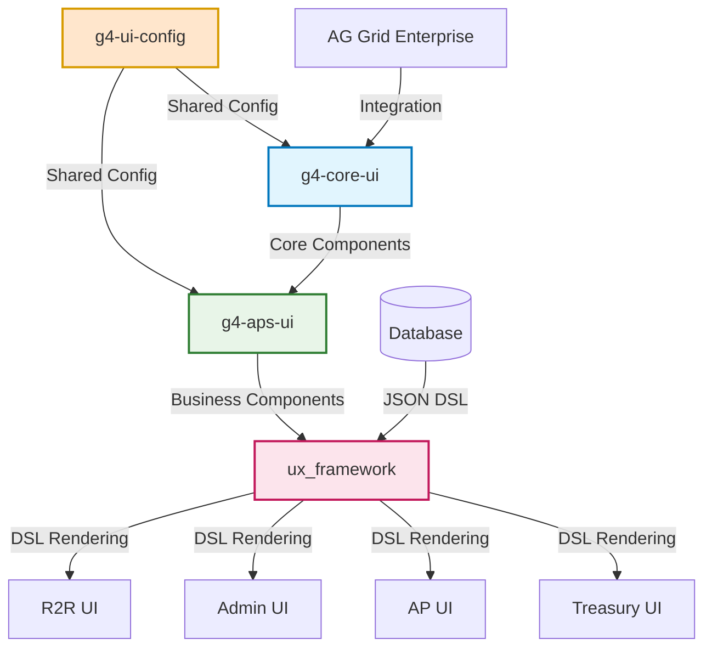
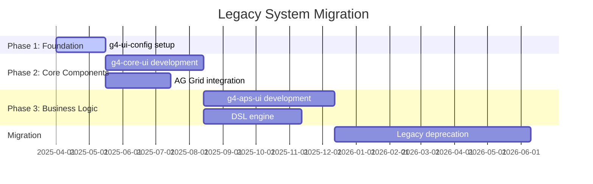

# HLP & LLP: HighRadius G4 Monorepo Architecture - H2 2025

## Executive Summary

This document outlines the High-Level Plan (HLP) and Low-Level Plan (LLP) for implementing a comprehensive monorepo architecture across three specialized projects: configuration management, core UI components, and business application components. The architecture is designed to support AG Grid Enterprise integration, DSL-driven rendering, and enterprise-grade component libraries.

---

## 📋 HIGH-LEVEL PLAN (HLP)

### 1. Strategic Objectives

#### Primary Goals
- **Unified Configuration Management**: Centralize all development tools and configurations
- **Component Library Standardization**: Create reusable, theme-consistent UI components
- **DSL-Driven Architecture**: Enable JSON-based dynamic UI rendering
- **AG Grid Enterprise Integration**: Provide enterprise-grade data grid solutions
- **Legacy System Migration**: Gradual deprecation of base_component and ux_framework

#### Success Metrics
| Metric | Target | Timeline |
|--------|--------|----------|
| Component Reuse Rate | >80% | Q4 2025 |
| Build Time Reduction | >70% | Q3 2025 |
| Bundle Size Optimization | <200KB per app | Q3 2025 |
| Developer Onboarding | <1 day | Q4 2025 |

### 2. Architecture Overview



### 3. Technology Stack

#### Core Infrastructure
- **Runtime**: Node.js LTS (v20+) with `.nvmrc`
- **Package Manager**: Yarn v4 with PnP and zero-install
- **Build System**: Turborepo with remote caching
- **TypeScript**: v5+ with strict configuration
- **Framework**: React 18+ with Concurrent Features

#### Development Tools
- **Linting**: ESLint with Airbnb + React Hooks rules
- **Formatting**: Prettier with unified configuration
- **Testing**: Jest + React Testing Library + Storybook
- **Documentation**: TypeDoc + Storybook + Docusaurus

---

## 🔧 LOW-LEVEL PLAN (LLP)

### Phase 1: @highradius/g4-ui-config (Q2 2025)

#### 1.1 Project Structure
```
packages/
├── typescript-config/          # Base TSConfig with strict rules
├── eslint-config/             # Airbnb + React + Perfectionist
├── prettier-config/           # Unified formatting rules
├── theme-config/              # HiRa MUI theme system
├── storybook-config/          # Component documentation setup
├── build-tools/               # Vite/Webpack configurations
├── git-hooks/                 # Husky + lint-staged
├── commit-config/             # Commitizen + commitlint
├── turborepo-config/          # Shared pipeline configurations
└── utilities/                 # Shared utility functions
```

#### 1.2 Implementation Tasks

**TypeScript Configuration**
```typescript
// packages/typescript-config/base.json
{
  "compilerOptions": {
    "strict": true,
    "noUncheckedIndexedAccess": true,
    "exactOptionalPropertyTypes": true,
    "paths": {
      "@hr/g4-core-ui/*": ["../g4-core-ui/packages/*/src"],
      "@hr/g4-aps-ui/*": ["../g4-aps-ui/packages/*/src"]
    }
  },
  "references": [
    { "path": "../g4-core-ui" },
    { "path": "../g4-aps-ui" }
  ]
}
```

**MUI Theme Configuration**
```typescript
// packages/theme-config/hira-theme.ts
export const hiraTheme = createTheme({
  palette: {
    primary: { main: '#1976d2' },
    secondary: { main: '#dc004e' },
    background: {
      default: '#fafafa',
      paper: '#ffffff'
    }
  },
  typography: {
    fontFamily: 'Inter, sans-serif',
    h1: { fontSize: '2rem', fontWeight: 600 }
  },
  components: {
    MuiButton: {
      styleOverrides: {
        root: { textTransform: 'none' }
      }
    }
  }
});
```

**Turborepo Pipeline**
```json
// packages/turborepo-config/pipeline.json
{
  "pipeline": {
    "build": {
      "dependsOn": ["^build"],
      "outputs": ["dist/**"],
      "cache": true
    },
    "dev": {
      "cache": false,
      "persistent": true
    },
    "test": {
      "outputs": ["coverage/**"],
      "inputs": ["src/**/*.{ts,tsx}", "test/**/*.{ts,tsx}"]
    },
    "lint": {
      "outputs": []
    },
    "storybook": {
      "cache": false
    }
  }
}
```

#### 1.3 Deliverables & Timeline
```markdown
- [ ] Week 1-2: Turborepo initialization with Yarn v4
- [ ] Week 3: TypeScript base configuration
- [ ] Week 4: ESLint + Prettier configuration
- [ ] Week 5-6: HiRa MUI theme implementation
- [ ] Week 7: Husky + lint-staged setup
- [ ] Week 8: Commitizen + commitlint configuration
- [ ] Week 9-10: Storybook preset configuration
- [ ] Week 11-12: Documentation and testing
```

### Phase 2: @highradius/g4-core-ui (Q2-Q3 2025)

#### 2.1 Project Structure
```
packages/
├── core-components/           # Atomic components
│   ├── button/               # Enhanced MUI Button
│   ├── input/                # Form controls
│   ├── tabs/                 # Navigation components
│   └── data-grid/            # AG Grid wrapper
├── typography/               # Text system
├── icons/                    # React Iconify integration
├── layouts/                  # Page layout components
├── themes/                   # Visual tokens
├── utils/                    # Component utilities
└── storybook/                # Component documentation
```

#### 2.2 AG Grid Enterprise Integration

**Grid Wrapper Component**
```typescript
// packages/core-components/data-grid/HiRaGrid.tsx
import { AgGridReact } from 'ag-grid-react';
import { useTheme } from '@mui/material/styles';
import 'ag-grid-enterprise';

interface HiRaGridProps {
  columnDefs: ColDef[];
  rowData: any[];
  variant?: 'simple' | 'enterprise' | 'tree';
  theme?: 'light' | 'dark';
  features?: {
    pagination?: boolean;
    sorting?: boolean;
    filtering?: boolean;
    grouping?: boolean;
    rowSelection?: boolean;
  };
  onGridReady?: (params: GridReadyEvent) => void;
  onSelectionChanged?: (params: SelectionChangedEvent) => void;
}

export const HiRaGrid: React.FC<HiRaGridProps> = ({
  columnDefs,
  rowData,
  variant = 'simple',
  theme,
  features = {},
  onGridReady,
  onSelectionChanged,
  ...props
}) => {
  const muiTheme = useTheme();
  const gridTheme = theme || (muiTheme.palette.mode === 'dark' ? 'dark' : 'light');

  const gridOptions: GridOptions = {
    animateRows: true,
    enableRangeSelection: variant === 'enterprise',
    enableCharts: variant === 'enterprise',
    treeData: variant === 'tree',
    pagination: features.pagination,
    paginationPageSize: 50,
    rowSelection: features.rowSelection ? 'multiple' : undefined,
    ...props
  };

  return (
    <div className={`ag-theme-hira-${gridTheme}`} style={{ height: '100%', width: '100%' }}>
      <AgGridReact
        columnDefs={columnDefs}
        rowData={rowData}
        gridOptions={gridOptions}
        onGridReady={onGridReady}
        onSelectionChanged={onSelectionChanged}
      />
    </div>
  );
};
```

**Custom CSS Variables for HiRa Theme**
```scss
// packages/core-components/data-grid/ag-grid-hira-theme.scss
.ag-theme-hira-light {
  --ag-foreground-color: #1976d2;
  --ag-background-color: #fafafa;
  --ag-header-foreground-color: #333;
  --ag-header-background-color: #f5f5f5;
  --ag-odd-row-background-color: #fcfcfc;
  --ag-row-hover-color: #e3f2fd;
  --ag-selected-row-background-color: #bbdefb;
  --ag-border-color: #e0e0e0;
  --ag-font-family: 'Inter', sans-serif;
  --ag-font-size: 14px;
}

.ag-theme-hira-dark {
  --ag-foreground-color: #90caf9;
  --ag-background-color: #121212;
  --ag-header-foreground-color: #fff;
  --ag-header-background-color: #1e1e1e;
  --ag-odd-row-background-color: #1a1a1a;
  --ag-row-hover-color: #1976d2;
  --ag-selected-row-background-color: #0d47a1;
  --ag-border-color: #333;
}
```

#### 2.3 Enhanced MUI Components

**Button Component with Variants**
```typescript
// packages/core-components/button/HiRaButton.tsx
import { Button, ButtonProps } from '@mui/material';
import { VariantProps, cva } from 'class-variance-authority';

const buttonVariants = cva('', {
  variants: {
    intent: {
      primary: 'bg-primary text-primary-foreground hover:bg-primary/90',
      secondary: 'bg-secondary text-secondary-foreground hover:bg-secondary/80',
      destructive: 'bg-destructive text-destructive-foreground hover:bg-destructive/90',
      outline: 'border border-input bg-background hover:bg-accent',
      ghost: 'hover:bg-accent hover:text-accent-foreground',
      link: 'text-primary underline-offset-4 hover:underline'
    },
    size: {
      default: 'h-10 px-4 py-2',
      sm: 'h-9 rounded-md px-3',
      lg: 'h-11 rounded-md px-8',
      icon: 'h-10 w-10'
    }
  },
  defaultVariants: {
    intent: 'primary',
    size: 'default'
  }
});

interface HiRaButtonProps extends ButtonProps, VariantProps<typeof buttonVariants> {
  loading?: boolean;
}

export const HiRaButton: React.FC<HiRaButtonProps> = ({
  intent,
  size,
  loading,
  children,
  disabled,
  ...props
}) => {
  return (
    <Button
      className={buttonVariants({ intent, size })}
      disabled={disabled || loading}
      {...props}
    >
      {loading && <CircularProgress size={16} />}
      {children}
    </Button>
  );
};
```

#### 2.4 Deliverables & Timeline
```markdown
- [ ] Week 1-2: Project setup and AG Grid license integration
- [ ] Week 3-4: HiRaGrid component with theming
- [ ] Week 5-6: Enhanced MUI components (Button, Input, Tabs)
- [ ] Week 7-8: Icon system with React Iconify
- [ ] Week 9-10: Layout components and utilities
- [ ] Week 11-12: Storybook documentation and testing
- [ ] Week 13-14: Performance optimization and bundle analysis
- [ ] Week 15-16: Integration testing and documentation
```

### Phase 3: @highradius/g4-aps-ui (Q3-Q4 2025)

#### 3.1 Project Structure
```
packages/
├── feature-components/        # Complex business components
│   ├── enhanced-grid/        # Feature-rich data grid
│   ├── dynamic-forms/        # JSON-driven forms
│   ├── dashboard-widgets/    # Analytics components
│   └── workflow-components/  # Process management
├── renderers/                # Cell and form renderers
│   ├── display/              # Read-only renderers
│   └── edit/                 # Input renderers
├── state-management/         # Redux toolkit setup
├── dsl-engine/               # JSON schema interpreter
├── providers/                # Context providers
└── hooks/                    # Custom React hooks
```

#### 3.2 DSL Engine Implementation

**DSL Schema Definition**
```typescript
// packages/dsl-engine/types.ts
export interface DSLComponent {
  id: string;
  type: 'DataGrid' | 'Form' | 'Dashboard' | 'Workflow';
  variant: string;
  sysName: string;
  configuration: {
    props: Record<string, any>;
    features: string[];
    caching?: {
      enabled: boolean;
      ttl: number;
      strategy: 'memory' | 'localStorage' | 'sessionStorage';
    };
    validation?: Record<string, any>;
  };
  children?: DSLComponent[];
}

export interface GridDSLConfig extends DSLComponent {
  type: 'DataGrid';
  variant: 'simple' | 'expandable-rows' | 'tree-data' | 'master-detail';
  configuration: {
    columns: ColumnDef[];
    data: any[];
    features: ('sorting' | 'filtering' | 'grouping' | 'pagination')[];
    rowSelection?: 'single' | 'multiple';
    expandable?: {
      detailComponent: string;
      expandedRowKeys: string[];
    };
  };
}
```

**DSL Renderer Engine**
```typescript
// packages/dsl-engine/DSLRenderer.tsx
import { memo } from 'react';
import { HiRaGrid } from '@hr/g4-core-ui/data-grid';
import { EnhancedGrid } from '../feature-components/enhanced-grid';

const componentRegistry = {
  DataGrid: {
    simple: HiRaGrid,
    'expandable-rows': EnhancedGrid,
    'tree-data': EnhancedGrid,
    'master-detail': EnhancedGrid
  },
  Form: {
    // Form variants
  },
  Dashboard: {
    // Dashboard variants
  }
};

export const DSLRenderer = memo<{ config: DSLComponent }>(({ config }) => {
  const Component = componentRegistry[config.type]?.[config.variant];

  if (!Component) {
    console.warn(`Component not found: ${config.type}.${config.variant}`);
    return <div>Component not found</div>;
  }

  return (
    <Component
      {...config.configuration.props}
      sysName={config.sysName}
      caching={config.configuration.caching}
    />
  );
});
```

#### 3.3 State Management with Redux Toolkit

**Store Configuration**
```typescript
// packages/state-management/store.ts
import { configureStore } from '@reduxjs/toolkit';
import { persistStore, persistReducer } from 'redux-persist';
import storage from 'redux-persist/lib/storage';
import { cacheSlice } from './slices/cacheSlice';
import { uiSlice } from './slices/uiSlice';
import { apiSlice } from './api/apiSlice';

const persistConfig = {
  key: 'hira-g4-aps',
  storage,
  whitelist: ['cache', 'ui']
};

const persistedReducer = persistReducer(persistConfig, {
  cache: cacheSlice.reducer,
  ui: uiSlice.reducer,
  api: apiSlice.reducer
});

export const store = configureStore({
  reducer: persistedReducer,
  middleware: (getDefaultMiddleware) =>
    getDefaultMiddleware({
      serializableCheck: {
        ignoredActions: ['persist/PERSIST', 'persist/REHYDRATE']
      }
    }).concat(apiSlice.middleware)
});

export const persistor = persistStore(store);
export type RootState = ReturnType<typeof store.getState>;
export type AppDispatch = typeof store.dispatch;
```

**Caching Slice**
```typescript
// packages/state-management/slices/cacheSlice.ts
import { createSlice, PayloadAction } from '@reduxjs/toolkit';

interface CacheItem {
  data: any;
  timestamp: number;
  ttl: number;
  strategy: 'memory' | 'localStorage' | 'sessionStorage';
}

interface CacheState {
  [sysName: string]: CacheItem;
}

const initialState: CacheState = {};

export const cacheSlice = createSlice({
  name: 'cache',
  initialState,
  reducers: {
    setCache: (state, action: PayloadAction<{
      sysName: string;
      data: any;
      ttl?: number;
      strategy?: 'memory' | 'localStorage' | 'sessionStorage';
    }>) => {
      const { sysName, data, ttl = 300000, strategy = 'memory' } = action.payload;
      state[sysName] = {
        data,
        timestamp: Date.now(),
        ttl,
        strategy
      };
    },

    getCache: (state, action: PayloadAction<string>) => {
      const sysName = action.payload;
      const cached = state[sysName];

      if (cached && (Date.now() - cached.timestamp) < cached.ttl) {
        return cached.data;
      }

      delete state[sysName];
      return null;
    },

    clearCache: (state, action: PayloadAction<string>) => {
      delete state[action.payload];
    },

    clearAllCache: (state) => {
      Object.keys(state).forEach(key => delete state[key]);
    }
  }
});

export const { setCache, getCache, clearCache, clearAllCache } = cacheSlice.actions;
```

#### 3.4 Enhanced Grid Component

**Feature-Rich Grid Implementation**
```typescript
// packages/feature-components/enhanced-grid/EnhancedGrid.tsx
import { useState, useCallback, useMemo } from 'react';
import { useDispatch, useSelector } from 'react-redux';
import { HiRaGrid } from '@hr/g4-core-ui/data-grid';
import { setCache, getCache } from '../../state-management/slices/cacheSlice';

interface EnhancedGridProps {
  columnDefs: ColDef[];
  rowData: any[];
  variant: 'expandable-rows' | 'tree-data' | 'master-detail';
  sysName: string;
  caching?: {
    enabled: boolean;
    ttl: number;
    strategy: 'memory' | 'localStorage' | 'sessionStorage';
  };
  expandable?: {
    detailComponent: React.ComponentType<any>;
    masterDetailHeight: number;
  };
}

export const EnhancedGrid: React.FC<EnhancedGridProps> = ({
  columnDefs,
  rowData,
  variant,
  sysName,
  caching,
  expandable,
  ...props
}) => {
  const dispatch = useDispatch();
  const cachedState = useSelector(state => getCache(state, sysName));

  const [gridApi, setGridApi] = useState<GridApi | null>(null);
  const [expandedRows, setExpandedRows] = useState<Set<string>>(new Set());

  const onGridReady = useCallback((params: GridReadyEvent) => {
    setGridApi(params.api);

    // Restore cached state
    if (cachedState && caching?.enabled) {
      if (cachedState.filterModel) {
        params.api.setFilterModel(cachedState.filterModel);
      }
      if (cachedState.sortModel) {
        params.api.setSortModel(cachedState.sortModel);
      }
    }
  }, [cachedState, caching]);

  const onFilterChanged = useCallback(() => {
    if (gridApi && caching?.enabled) {
      const filterModel = gridApi.getFilterModel();
      const sortModel = gridApi.getSortModel();

      dispatch(setCache({
        sysName,
        data: { filterModel, sortModel },
        ttl: caching.ttl,
        strategy: caching.strategy
      }));
    }
  }, [gridApi, caching, sysName, dispatch]);

  const enhancedColumnDefs = useMemo(() => {
    if (variant === 'expandable-rows' || variant === 'master-detail') {
      return [
        {
          headerName: '',
          field: 'expand',
          cellRenderer: 'agGroupCellRenderer',
          width: 50,
          pinned: 'left'
        },
        ...columnDefs
      ];
    }
    return columnDefs;
  }, [columnDefs, variant]);

  const gridOptions: GridOptions = {
    masterDetail: variant === 'master-detail',
    detailCellRendererParams: expandable ? {
      detailGridOptions: {
        columnDefs: expandable.detailComponent,
        rowHeight: expandable.masterDetailHeight
      }
    } : undefined,

    isRowMaster: variant === 'master-detail' ? (dataItem) => {
      return dataItem ? dataItem.hasDetails : false;
    } : undefined,

    treeData: variant === 'tree-data',
    animateRows: true,
    enableRangeSelection: true,
    enableCharts: true,
    onFilterChanged,
    onSortChanged: onFilterChanged
  };

  return (
    <HiRaGrid
      columnDefs={enhancedColumnDefs}
      rowData={rowData}
      variant="enterprise"
      onGridReady={onGridReady}
      gridOptions={gridOptions}
      {...props}
    />
  );
};
```

#### 3.5 Renderer System

**Display Renderers**
```typescript
// packages/renderers/display/index.ts
export const TextRenderer = ({ value, formatting }) => {
  return <Typography variant="body2">{formatting ? format(value, formatting) : value}</Typography>;
};

export const NumberRenderer = ({ value, precision = 2, currency }) => {
  const formatted = new Intl.NumberFormat('en-US', {
    minimumFractionDigits: precision,
    maximumFractionDigits: precision,
    style: currency ? 'currency' : 'decimal',
    currency: currency || 'USD'
  }).format(value);

  return <Typography variant="body2" align="right">{formatted}</Typography>;
};

export const DateRenderer = ({ value, format = 'MM/dd/yyyy' }) => {
  const formatted = value ? formatDate(new Date(value), format) : '';
  return <Typography variant="body2">{formatted}</Typography>;
};

export const ChipRenderer = ({ value, colorMap, variant = 'filled' }) => {
  const color = colorMap?.[value] || 'default';
  return <Chip label={value} color={color} variant={variant} size="small" />;
};
```

**Edit Renderers**
```typescript
// packages/renderers/edit/index.ts
export const TextEditRenderer = forwardRef(({ value, onChange, validation, ...props }, ref) => {
  const [error, setError] = useState('');

  const handleChange = useCallback((event) => {
    const newValue = event.target.value;

    if (validation) {
      try {
        validation.validateSync(newValue);
        setError('');
      } catch (err) {
        setError(err.message);
      }
    }

    onChange(newValue);
  }, [onChange, validation]);

  return (
    <TextField
      ref={ref}
      value={value || ''}
      onChange={handleChange}
      error={!!error}
      helperText={error}
      variant="outlined"
      size="small"
      fullWidth
      {...props}
    />
  );
});
```

#### 3.6 Deliverables & Timeline
```markdown
- [ ] Week 1-2: Redux Toolkit store setup and caching system
- [ ] Week 3-4: DSL engine and component registry
- [ ] Week 5-6: Enhanced Grid with expandable rows and tree data
- [ ] Week 7-8: Master-detail grid implementation
- [ ] Week 9-10: Display and edit renderer system
- [ ] Week 11-12: Dynamic form builder
- [ ] Week 13-14: Dashboard widgets and workflow components
- [ ] Week 15-16: Integration testing and performance optimization
- [ ] Week 17-18: Documentation and migration guides
```

---

## 🔄 Integration & Migration Strategy

### 1. Dependency Flow
```
g4-aps-ui → g4-core-ui → g4-ui-config
```

### 2. Migration Timeline


### 3. Package Versioning Strategy
```json
{
  "workspaces": [
    "packages/@highradius/g4-ui-config/*",
    "packages/@highradius/g4-core-ui/*",
    "packages/@highradius/g4-aps-ui/*"
  ],
  "packageManager": "yarn@4.0.0",
  "engines": {
    "node": ">=20.0.0",
    "yarn": ">=4.0.0"
  }
}
```

---

## 📊 Quality Assurance & Success Metrics

### 1. Technical KPIs
| Metric | Target | Measurement |
|--------|--------|-------------|
| Bundle Size | <200KB gzipped | Webpack Bundle Analyzer |
| Build Time | <2min full build | Turborepo analytics |
| Test Coverage | >90% | Jest coverage reports |
| Type Safety | 100% TS coverage | TSC strict mode |
| Performance | <100ms DSL render | React Profiler |

### 2. Business KPIs
| Metric | Target | Timeline |
|--------|--------|----------|
| Developer Velocity | 50% faster | Q4 2025 |
| Component Reuse | 80% adoption | Q4 2025 |
| Migration Complete | 100% legacy deprecated | Q1 2026 |
| Performance Gain | 30% load time improvement | Q4 2025 |

### 3. Risk Mitigation
| Risk | Impact | Mitigation |
|------|--------|------------|
| AG Grid License | High | Proper license management & fallback |
| Bundle Size | Medium | Code splitting & lazy loading |
| Performance | Medium | Virtualization & memoization |
| Migration Complexity | High | Phased approach & parallel systems |

---

## 📚 Documentation & Resources

### 1. Documentation Strategy
- **API Documentation**: TypeDoc for all packages
- **Component Library**: Storybook with CSF stories
- **Architecture**: ADRs and technical specifications
- **Integration Guides**: Step-by-step migration documentation

### 2. Training & Onboarding
- Developer workshops for each monorepo
- Video tutorials for DSL configuration
- Best practices documentation
- Code review guidelines

### 3. Monitoring & Analytics
- Bundle size monitoring with CI/CD integration
- Performance metrics collection
- Usage analytics for component adoption
- Error tracking and reporting

---

**Document Version**: 1.0.0
**Last Updated**: 2025-01-27
**Owner**: HighRadius G4 Architecture Team
**Review Cycle**: Monthly
**Next Review**: 2025-02-27
