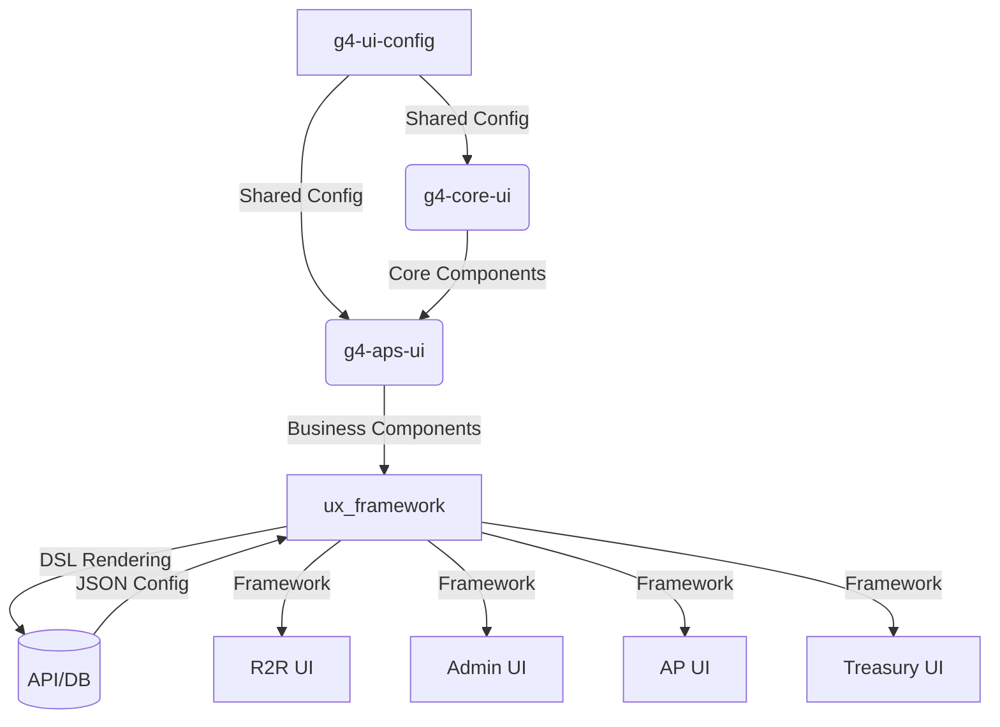
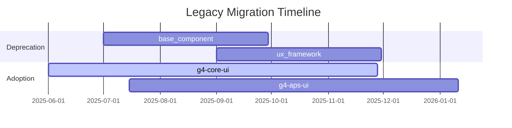

### High-Level Plan (HLP) & Low-Level Plan (LLP) for HighRadius G4 Monorepos

#### **Architecture Overview**


---

### **1. @highradius/g4-ui-config (Configuration Monorepo)**

#### **HLP: Configuration Hub**
- **Objective**: Centralize all development configurations and tools
- **Key Deliverables**:
  - Standardized TypeScript/ESLint/Prettier configs
  - Reusable MUI theme provider
  - Commit standardization workflow
  - Turborepo-optimized build pipelines
- **Timeline**: H2 2025

#### **LLP: Implementation Tasks**
```markdown
- [ ] 1.1: Turborepo initialization (`yarn create turbo`)
- [ ] 1.2: Yarn v4 zero-install setup (`.yarnrc.yml`)
- [ ] 1.3: Husky + lint-staged integration
- [ ] 1.4: Commitizen + commitlint configuration
- [ ] 1.5: MUI theme package with HiRa palette
- [ ] 1.6: Storybook preset configuration
- [ ] 1.7: Turborepo remote caching (Vercel/AWS)
- [ ] 1.8: Documentation (Docusaurus + TypeDoc)
```

---

### **2. @highradius/g4-core-ui (Component Library Monorepo)**

#### **HLP: Core Component Foundation**
- **Objective**: Build reusable UI components with AG Grid integration
- **Key Deliverables**:
  - AG Grid wrapper with HiRa theming
  - 30+ atomic components (Button, Input, etc.)
  - Icon system with React-Iconify
  - Storybook documentation portal
- **Timeline**: H2 2025

#### **LLP: AG Grid Implementation**
```typescript
// packages/grid/AgGridWrapper.tsx
import { AgGridReact } from 'ag-grid-react';
import { useTheme } from '@mui/material';

export const HiRaGrid = ({ config }) => {
  const theme = useTheme();
  return (
    <div className={`ag-theme-${theme.palette.mode}-hira`}>
      <AgGridReact
        rowData={config.data}
        columnDefs={config.columns}
        enableEnterpriseModules={true}
        gridOptions={{
          domLayout: 'autoHeight',
          animateRows: true
        }}
      />
    </div>
  )
}
```

#### **Component Development Tasks**
```markdown
- [ ] 2.1: AG Grid enterprise license integration
- [ ] 2.2: Custom cell renderers (Boolean/Date/Text)
- [ ] 2.3: MUI component enhancements (Button/Input/Tabs)
- [ ] 2.4: Theme integration from g4-ui-config
- [ ] 2.5: Storybook visual testing setup
- [ ] 2.6: Component documentation (TypeDoc)
- [ ] 2.7: Vite library mode configuration
```

---

### **3. @highradius/g4-aps-ui (Business Components Monorepo)**

#### **HLP: DSL-Driven Component System**
- **Objective**: Build business features with JSON-configurable variants
- **Key Deliverables**:
  - DSL engine for JSON-based rendering
  - Redux Toolkit state management
  - Component-level caching system
  - Display/edit renderer system
- **Timeline**: H2 2025

#### **LLP: DSL Engine Implementation**
```typescript
// packages/dsl-engine/renderer.tsx
const componentRegistry = {
  Grid: dynamic(() => import('@hr/g4-core-ui/grid')),
  Form: dynamic(() => import('@hr/g4-aps-ui/form-renderers'))
};

export const DSLEngine = ({ config }) => {
  const Component = componentRegistry[config.type];
  return <Component {...config.props} sysName={config.sysName} />;
};
```

#### **Caching & State Management**
```typescript
// packages/state-management/cacheSlice.ts
export const cacheSlice = createSlice({
  name: 'cache',
  initialState: {},
  reducers: {
    setCache: (state, { payload: { sysName, data } }) => {
      state[sysName] = {
        data,
        timestamp: Date.now(),
        ttl: 300_000 // 5 minutes
      };
    },
    clearCache: (state, { payload: sysName }) => {
      delete state[sysName];
    }
  }
});
```

#### **Implementation Tasks**
```markdown
- [ ] 3.1: Redux Toolkit store configuration
- [ ] 3.2: DSL parser implementation
- [ ] 3.3: Component variant system (Grid types)
- [ ] 3.4: Renderer system (Display/Edit)
- [ ] 3.5: Context-based caching by sysName
- [ ] 3.6: API data caching middleware
- [ ] 3.7: User interaction state persistence
- [ ] 3.8: Validation integration (Yup/Zod)
```

---

### **Cross-Monorepo Integration**

#### **Dependency Management**
```json
// g4-core-ui/package.json
{
  "dependencies": {
    "@highradius/g4-ui-config": "workspace:*",
    "ag-grid-enterprise": "^30.0.0"
  },
  "peerDependencies": {
    "react": "^18.0.0",
    "@mui/material": "^5.0.0"
  }
}
```

#### **Turborepo Pipeline**
```json
// turbo.json
{
  "pipeline": {
    "build": {
      "dependsOn": ["^build"],
      "outputs": ["dist/**"]
    },
    "test": {
      "outputs": ["coverage/**"]
    },
    "storybook": {
      "cache": false
    }
  }
}
```

#### **Migration Strategy**


---

### **Quality Assurance & Monitoring**

#### **Validation Metrics**
| **Metric**               | **Target** | **Tool**               |
|--------------------------|------------|------------------------|
| Component test coverage  | > 80%      | Jest/Vitest            |
| Bundle size (core-ui)    | < 100kb    | Webpack Bundle Analyzer|
| Build time reduction     | > 70%      | Turborepo analytics    |
| DSL render performance   | < 100ms    | React Profiler         |

#### **Risk Mitigation**
| **Risk**                          | **Mitigation Strategy**                     |
|------------------------------------|---------------------------------------------|
| AG Grid theme inconsistencies      | CSS variable audit tool                     |
| DSL parsing performance            | Dynamic imports + React Suspense            |
| State management complexity        | Redux Toolkit + RTK Query                   |
| Configuration drift                | Version locking (workspace:*)               |

[Download Full HLP/LLP Specification](https://gist.githubusercontent.com/ai-assistant/highradius-g4-monorepo/raw/main/hlp-llp-spec.md)
*Includes detailed implementation timelines, owner assignments, and integration checklists*